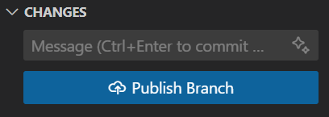
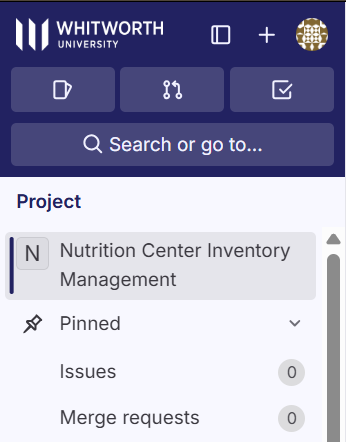
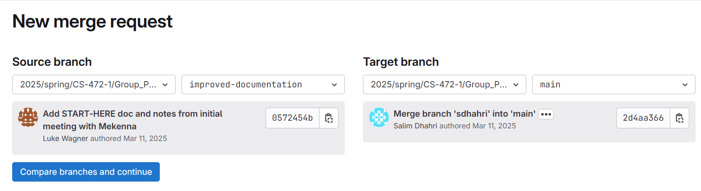
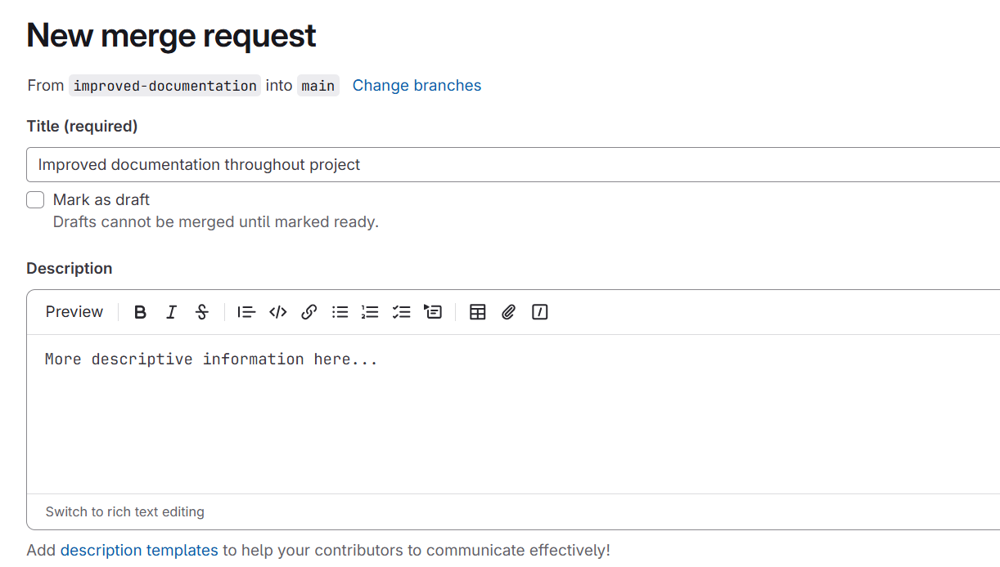
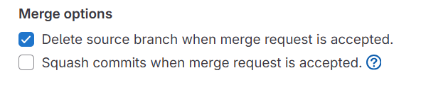

# Contribution Guidelines

## Purpose:

To provide a standardized procedure for all devs to follow when making and submitting code changes.

## Overview:

When making changes, work on a local branch named after the feature you are working on. Example: the branch I am working on while writing this document is named "improved-documentation." When the changes are complete, commit to the local branch with a descriptive commit message.

If working in VSCode, should be able to publish branch through source control sidebar.

#### Next, create a merge request for this branch.

WhitGit should show the following in the top-left corner. Click "Merge requests."

Settings should be set as following (source set to new branch, target set to main):

The title should highlight at a high-level the changes made. The description field can be more in-depth with specific changes made.

Select another dev to review the merge request. Do not assign yourself. The following box should also be checked:

#### This merge request is ready to submit!

___

File authors: Luke Wagner  
Last Modified: 3/11/2025  
Reviewers (add name and date):  